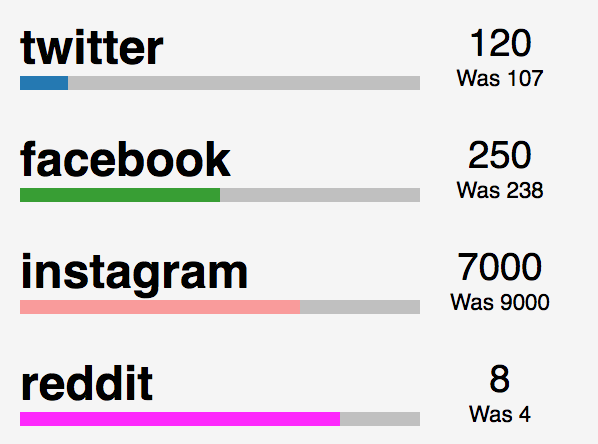

# social-stats
A web component to visualise progress towards a target




## Usage

```HTML
      <social-stats name='twitter' oldnum='107' newnum='120' target='1000' colour='#1f78b4'></social-stats>
      <social-stats name='facebook' oldnum='238' newnum='250' target='500' colour='#33a02c'></social-stats>
      <social-stats name='instagram' oldnum='9000' newnum='7000' target='10000' colour='#fb9a99'></social-stats>
      <social-stats name='reddit' oldnum='4' newnum='8' target='10' colour='#FF00FF'></social-stats>
```


## About

This repository was created to co-incide with a blog post describing how to get started making web components.
